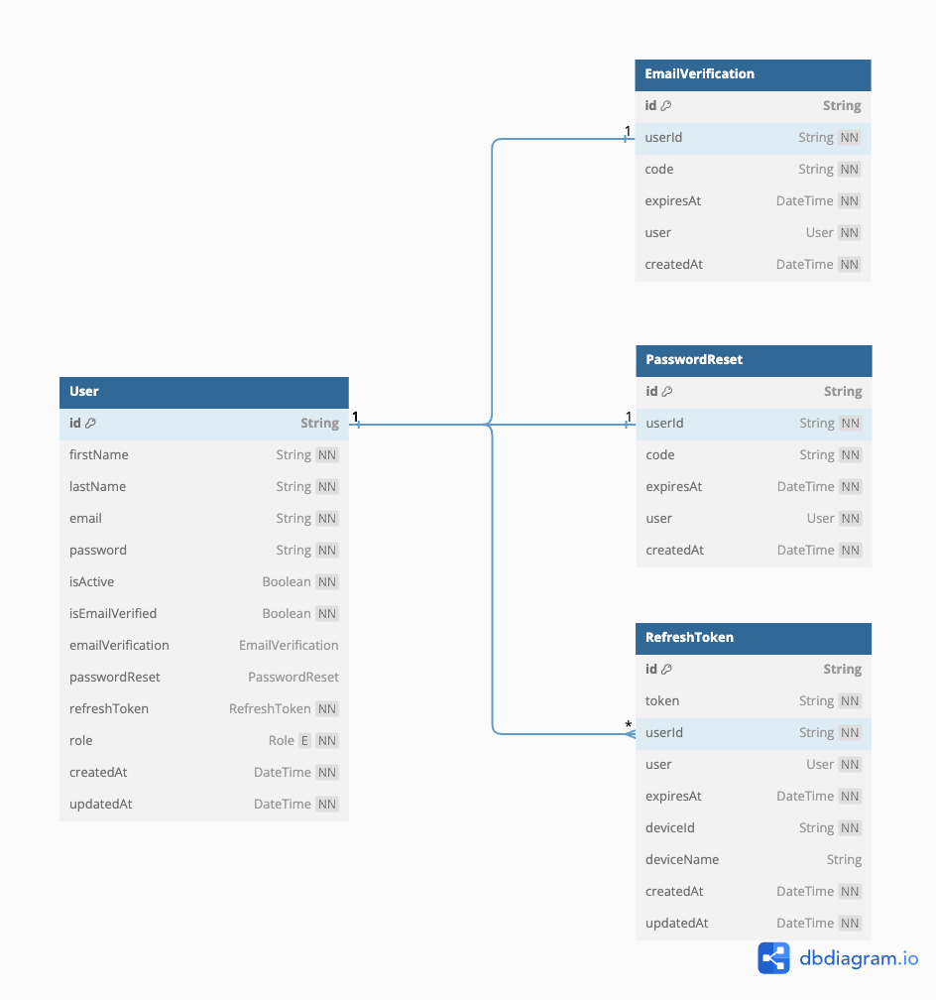

# Database Design and Implementation Workflow

This kickstarter uses Prisma ORM to interact with the database.

1. Write your db schema
2. Run `npx prisma migrate dev` to migrate your changes
3. Run `npx prisma generate` to generate your type defnitions from your db schema
4. Start writing your application logic

Prisma provides Prisma Studio at http://localhost:5555/ to make it easy to visualize the database changes and data. Run

```bash
npx prisma studio
```

To spin up the studio.

## Visualize your schema

This kickstarter is configured with dbml generator to generate DBML file everytime there is database schema change. This file will be colocated with the
database schema. Find the sample code below.

```dbml
Table User {
  id String [pk]
  firstName String [not null]
  lastName String [not null]
  email String [unique, not null]
  password String [not null]
  isActive Boolean [not null, default: false]
  isEmailVerified Boolean [not null, default: false]
  emailVerification EmailVerification
  passwordReset PasswordReset
  refreshToken RefreshToken [not null]
  role Role [not null, default: 'USER']
  createdAt DateTime [default: `now()`, not null]
  updatedAt DateTime [not null]
}
```

Inorder to visualize the schema copy all the contents of the `schema.dbml` file from `./prisma/schema/dbml/schema.dbml` and paste it in
https://dbdiagram.io


